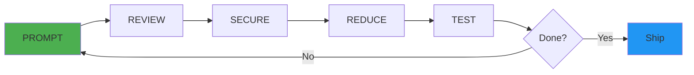
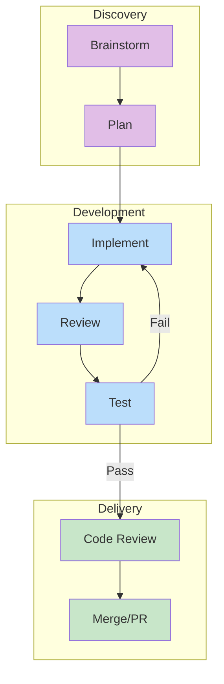
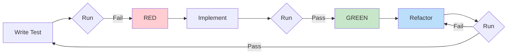
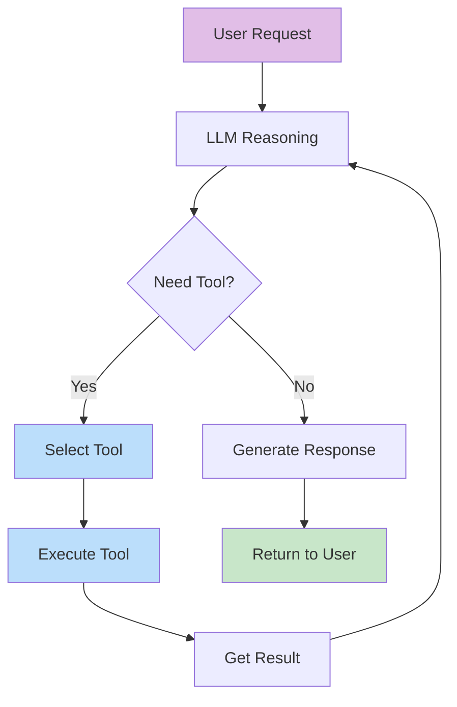
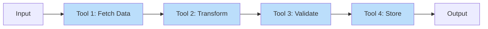
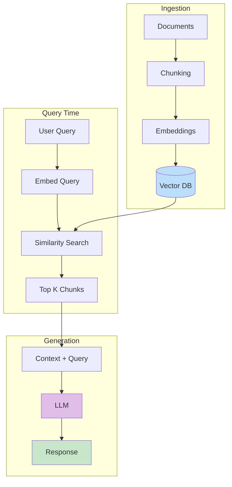
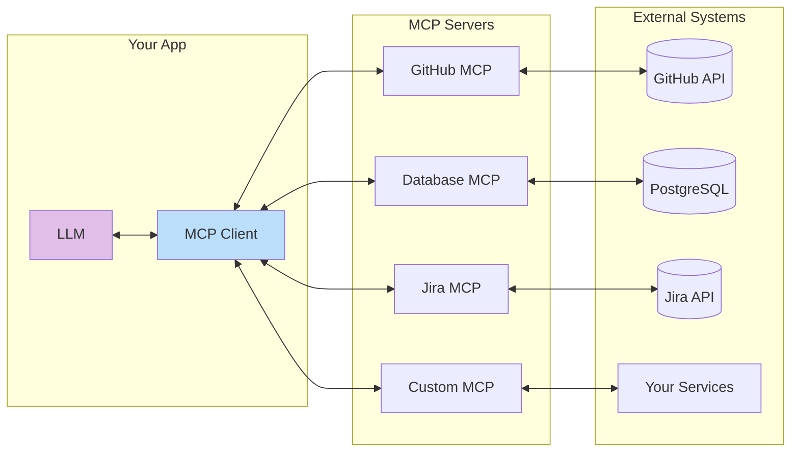
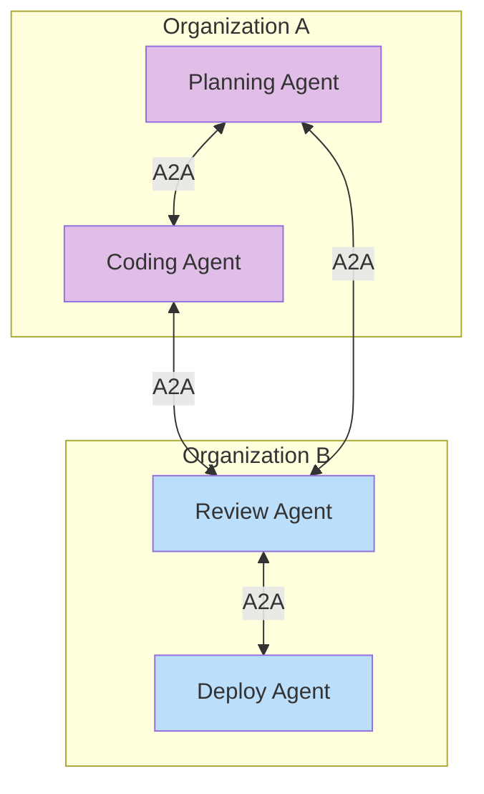
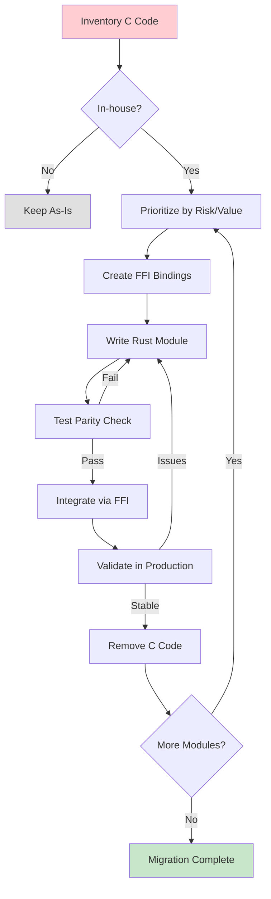

# Software Engineering in 2026

Are you already behind? Probably! Let's fix that.

## TLDR Workflow



```
1. PROMPT   → One focused task at a time
2. REVIEW   → Use a diff viewer
3. SECURE   → Check for injection, secrets, OWASP top 10
4. REDUCE   → Refactor and minimize complexity
5. TEST     → Run tests, smoke test
6. REPEAT   → Iterate until production-ready
```

**Golden Rules:**
- Never ship unreviewed code
- Smaller prompts = better results
- AI writes it, you own it

**Example Prompts for Each Step:**
```
PROMPT:   "Add a logout button to the navbar that clears the session and redirects to /login"
REVIEW:   "Show me a diff of all changes you just made"
SECURE:   "Review this code for OWASP top 10 vulnerabilities, especially injection and auth issues"
REDUCE:   "Refactor this to remove duplication and simplify the logic"
TEST:     "Write unit tests for the logout function, then run them"
REPEAT:   "The redirect isn't working on mobile Safari - investigate and fix"
```

## The AI Reality Check

**For non-engineers:** AI seems magical. It's a senior developer who never sleeps.

**For daily engineers:** You'll see the limits:
- Produces plausible code that needs review
- Doesn't understand your architecture without guidance
- Optimizes for wrong things without constraints
- Requires discipline for production-quality results

The gap between "runs" and "ships to production" is where expertise matters.

**Productivity Paradox:**
- Non-engineers see 10,000% improvement (can't build → prototype).
- Engineers see ~20% boost.

Headlines are calibrated for non-engineers. AI amplifies engineers, doesn't replace them.

## Core Philosophy

**"Can the AI do the work for me? Yes!"**

- AI writes the code
- AI validates the code
- AI handles docs, specs, presentations too

## AI Caution

- AI hallucinates and makes mistakes
- Verify critical code and security decisions
- Don't vibe-code sensitive apps (fintech, healthcare) without expertise
- Human oversight remains essential

## Your Role: Director of Agents

The typing is solved. Now you need deeper engineering skills to guide AI effectively.

**Your new responsibilities:**
- Architecture, planning, testing, verification
- Review code with a proper diff viewer
- Provide approvals as Director of Agents

**Observability is critical.** AI code may work but fail silently. Use:
- OpenTelemetry (instrumentation)
- Grafana (visualization)
- Splunk (log aggregation)

## CLAUDE.md Configuration

Create separate CLAUDE.md files using ALWAYS/NEVER format:
- Root: general rules
- Frontend: UI patterns
- Backend: server conventions
- Python/Data: data science workflows

Reference: https://www.anthropic.com/engineering/claude-code-best-practices

## Breaks Are Easy Now

- Submit prompt, take a break
- Background agents process while you're away
- Parallel subagents: 2-day tasks → 4 hours

## Generative Coding Workflow



**Brainstorm → Plan → Implement** (separate prompts):

1. **Brainstorm**: Discuss approach with AI
2. **Plan**: Create implementation plan before coding
3. **Implement**: Execute in focused chunks
4. **Review**: Verify requirements met
5. **Test**: RED/GREEN TDD
6. **Code Review**: Subagent or second session
7. **Merge/PR**: Create PR, merge

**Git Worktrees:** Create per task to avoid conflicts, keep main clean.

**Let AI Write Prompts:** Point Claude at a planning doc, ask it to write prompts for execution.

## Prompting Guidelines

- **Intent**: Be clear about what you want
- **Goal**: State expected outcome
- **Simple**: Break complex tasks into smaller ones
- **Context**: Provide background
- **Best Practices**: Say it explicitly, tell AI to have strong opinions

**Example Prompts by Principle:**

| Principle | Bad Prompt | Good Prompt |
|-----------|------------|-------------|
| **Intent** | "Fix the bug" | "Fix the null pointer exception in UserService.getProfile() when user ID doesn't exist" |
| **Goal** | "Make it faster" | "Reduce API response time to under 200ms by adding Redis caching to the product lookup" |
| **Simple** | "Build the entire checkout flow" | "Create the cart summary component that displays line items, quantities, and subtotal" |
| **Context** | "Add authentication" | "Add JWT authentication to our Express API. We're using PostgreSQL and have a users table with email/password_hash columns" |
| **Best Practices** | "Write some tests" | "Write unit tests for the payment module. Use Jest, mock external APIs, aim for 80% coverage. Follow AAA pattern (Arrange-Act-Assert)" |

**Prompts That Get Better Results:**
```
"Before implementing, explain your approach and ask clarifying questions"
"Use the existing patterns in src/services/ - don't introduce new abstractions"
"This is a financial calculation - prioritize correctness over cleverness"
"Keep it simple. Don't add error handling for cases that can't happen"
```

## Project Planning

### Documents to Create
| Document | Content |
|----------|---------|
| USER_STORIES.md | "As a [ROLE], I should be able to [feature]" |
| DATA_MODELS.md | Database architecture, endpoint schemas |
| TECH_STACK.md | Technology choices and rationale |
| DEVELOPMENT_PLAN.md | Phased implementation |
| SECURITY_PLAN.md | Security considerations |

**Example Prompts for Document Creation:**
```
USER_STORIES.md:
"Generate user stories for a food delivery app. Include roles: customer, restaurant owner,
delivery driver, admin. Format: 'As a [role], I should be able to [action] so that [benefit]'"

DATA_MODELS.md:
"Based on these user stories, design the PostgreSQL schema. Include tables, relationships,
indexes, and constraints. Use snake_case. Add created_at/updated_at to all tables."

TECH_STACK.md:
"Recommend a tech stack for this food delivery app. Consider: real-time tracking,
payment processing, push notifications, 10K concurrent users. Justify each choice."

DEVELOPMENT_PLAN.md:
"Create a phased development plan. Phase 1: MVP (ordering + payment). Phase 2:
Real-time tracking. Phase 3: Analytics. List specific tasks for each phase."

SECURITY_PLAN.md:
"Identify security requirements for this app. Cover: authentication, payment data (PCI),
location data privacy, API security, admin access controls."
```

### Planning Steps
1. Describe app and features to AI
2. Generate user stories for ALL roles
3. Create database schema from stories
4. Plan security early, implement later
5. Bootstrap with framework scaffolding
6. Create README.md
7. Set up git repo

**Example Prompts for Planning Steps:**
```
Step 1: "I'm building a SaaS invoicing tool for freelancers. Features: create invoices,
        track payments, send reminders, generate reports. Ask me questions to clarify scope."

Step 2: "Generate comprehensive user stories for: freelancer, client (invoice recipient),
        accountant (read-only access). Include edge cases like partial payments, disputes."

Step 3: "Design the database schema for this invoicing system. I need to support multiple
        currencies, recurring invoices, and payment tracking. Show me the ERD."

Step 5: "Bootstrap a Next.js 14 app with TypeScript, Tailwind, Prisma, and NextAuth.
        Set up the folder structure following feature-based organization."

Step 6: "Create a README.md with: project overview, setup instructions, environment
        variables needed, and contributing guidelines."
```

### Avoid Premature Optimization
AI optimizes too early. Watch for rate limiting, retry logic, caching before basics work. Ask: "Is this necessary for launch?" If not, add to "FUTURE IMPROVEMENTS".

## Code Quality Tools

| Category | Tools |
|----------|-------|
| **Linters** | Biome.js (JS), StyleLint (CSS), Ruff (Python), Rubocop (Ruby), golangci-lint (Go), clippy (Rust) |
| **Type Systems** | TypeScript (JS), BasedPydantic/mypy (Python), Sorbet (Ruby) |

Ask AI to use linters, type checkers, test runners, and profilers.

## AI Validation Checklist

Security review, smoke testing, stress testing, code reduction, test coverage, documentation, dead code removal, 12 Factor coverage, observability coverage

## TDD with AI



**RED/GREEN Workflow:**
1. Write failing test (RED)
2. Implement to pass (GREEN)
3. Refactor if needed
4. Next test

AI writes tests from user stories. Use eval frameworks (LangFuse, LangSmith) for AI-powered features.

**Example TDD Prompts:**
```
Starting TDD:
"I need to implement a discount calculator. Before writing any code, write failing tests for:
- Percentage discounts (10% off $100 = $90)
- Fixed amount discounts ($15 off $100 = $85)
- Minimum purchase requirements
- Stacking multiple discounts
Use Jest. Make them fail first."

RED Phase:
"Write a failing test for the user registration flow. Test that:
- Valid email/password creates a user
- Duplicate email returns 409
- Weak password returns 400 with specific message
Don't implement yet - just the test."

GREEN Phase:
"The test is failing as expected. Now implement the minimum code to make it pass.
Don't add extra features or error handling beyond what the test requires."

Refactor Phase:
"All tests pass. Now refactor the implementation to:
- Extract validation logic to a separate function
- Remove any duplication
- Improve naming
Run tests after each change to ensure they still pass."

Test from User Story:
"Based on this user story: 'As a user, I should be able to reset my password via email'
Write integration tests covering: request reset, valid token, expired token, invalid token."
```

## Debugging with AI

**Create these scripts:**
- `trace.sh`: Capture distributed traces
- `profile.sh`: Run CPU/memory profilers
- `debug.sh`: Attach debugger
- `logs.sh`: Aggregate and filter logs

Scripts give AI standardized diagnostic info and reduce back-and-forth.

**Provide debug info from:** Server logs, browser console, network dev tools

**Example Debugging Prompts:**
```
Initial Bug Report:
"Users report checkout fails intermittently. Here's what I know:
- Happens ~10% of the time
- More frequent during peak hours
- No errors in Sentry
- Users see 'Something went wrong' message
Help me create a debugging plan."

With Error Logs:
"Here's the error stack trace:
[paste stack trace]
The error started after yesterday's deploy. Here's the diff: [paste or reference PR]
What's the likely cause?"

Performance Issue:
"The /api/products endpoint takes 3-5 seconds. Here's the trace from OpenTelemetry:
[paste trace]
Database query takes 2.8s. Here's the query: [paste query]
Suggest optimizations."

Systematic Debugging:
"I've tried:
1. Restarting the service - no change
2. Rolling back to previous version - still happens
3. Checking database connections - all healthy
What should I check next? Give me specific commands to run."

Frontend Issue:
"Button click does nothing. Browser console shows:
[paste console output]
Network tab shows the request returns 200 but component doesn't update.
Here's the React component: [reference file]"

Reproducing Issues:
"Write a test that reproduces this bug: [describe bug]
Once we have a failing test, we can fix it properly."
```

## Vibe Coding vs SE-Focused Generative Coding

| Vibe Coding | SE-Focused |
|-------------|------------|
| "Build feature XYZ" | Small, focused tasks |
| Paste error stack | Structured approach |
| Large brush strokes | "Create function with these inputs/outputs" |

## Agents and Tool Calling

Agents are LLMs that can take actions through tool calling. Unlike chat completions, agents execute multi-step workflows by deciding which tools to invoke.

### The Agent Loop



### Deterministic vs Autonomous Workflows

| Deterministic | Autonomous |
|---------------|------------|
| Fixed sequence of tools | LLM decides tool order |
| Predictable execution | Adaptive to context |
| Easier to test/debug | More flexible |
| Lower cost (fewer LLM calls) | Higher cost |
| Use for: pipelines, ETL | Use for: open-ended tasks |

### Tool Calling Basics

Tools are functions the LLM can invoke. Define with name, description, and parameters:

```typescript
// Tool definition (Anthropic format)
const tools = [{
  name: "get_weather",
  description: "Get current weather for a location",
  input_schema: {
    type: "object",
    properties: {
      location: { type: "string", description: "City name" },
      units: { type: "string", enum: ["celsius", "fahrenheit"] }
    },
    required: ["location"]
  }
}];

// Tool implementation
async function get_weather({ location, units = "celsius" }) {
  const response = await fetch(`https://api.weather.com/${location}`);
  return response.json();
}
```

### Deterministic Workflows with Tools

Force specific tool sequences for predictable pipelines:



```python
# Deterministic pipeline - tools called in fixed order
async def process_order(order_id: str):
    # Step 1: Always fetch order first
    order = await tools.fetch_order(order_id)

    # Step 2: Always validate
    validation = await tools.validate_order(order)
    if not validation.valid:
        return {"error": validation.errors}

    # Step 3: Always calculate pricing
    pricing = await tools.calculate_pricing(order)

    # Step 4: Always process payment
    payment = await tools.process_payment(order, pricing)

    # Step 5: LLM generates confirmation (only creative step)
    confirmation = await llm.generate(
        f"Write a friendly order confirmation for {order}"
    )

    return {"status": "success", "message": confirmation}
```

### Hybrid Approach: Constrained Autonomy

Let LLM choose tools, but constrain the options:

```python
# Only expose relevant tools per step
def get_tools_for_step(step: str) -> list:
    tool_sets = {
        "research": ["web_search", "read_file", "query_database"],
        "implement": ["write_file", "run_tests", "lint_code"],
        "review": ["read_file", "static_analysis", "security_scan"],
        "deploy": ["build", "deploy_staging", "run_smoke_tests"]
    }
    return tool_sets.get(step, [])

# Agent only sees tools relevant to current phase
current_tools = get_tools_for_step("implement")
response = await llm.chat(messages, tools=current_tools)
```

### Tool Design Best Practices

| Do | Don't |
|----|-------|
| Descriptive names (`create_github_pr`) | Vague names (`do_thing`) |
| Clear parameter descriptions | Assume LLM knows your schema |
| Return structured data | Return unformatted strings |
| Include error states in schema | Let tools throw unhandled errors |
| Idempotent operations | Side effects without confirmation |

### Error Handling in Tool Calls

```typescript
// Return errors as data, not exceptions
async function risky_tool(params) {
  try {
    const result = await doRiskyOperation(params);
    return { success: true, data: result };
  } catch (error) {
    return {
      success: false,
      error: error.message,
      suggestion: "Try with different parameters"
    };
  }
}
```

### Example Prompts for Agent Development
```
Deterministic Pipeline:
"Create an agent that processes invoices in this exact order:
1. Extract data from PDF (tool: extract_pdf)
2. Validate against schema (tool: validate_invoice)
3. Check for duplicates (tool: check_duplicates)
4. Insert into database (tool: insert_record)
5. Generate confirmation email (LLM generation)
No deviation from this order. Return error if any step fails."

Tool Design:
"Design a tool schema for interacting with our inventory system. Include:
- get_product(sku) - fetch product details
- update_stock(sku, quantity) - adjust inventory
- reserve_stock(sku, quantity, order_id) - temporary hold
Make all operations idempotent. Return structured errors."

Constrained Agent:
"Build an agent for customer support that can ONLY use these tools:
- lookup_order(order_id)
- check_shipping_status(tracking_number)
- create_support_ticket(summary, priority)
- escalate_to_human(reason)
It should NEVER have access to refund or cancellation tools."
```

## AI Agents and Skills

You can write agents that write agents. Claude Code is built this way.

### Skills (Superpowers)
Markdown files teaching agents specific tasks:
- Agents learn by reading SKILL.md files
- Self-improving agents write their own skills
- Test skills on subagents for reliability

### Skill Workflow
1. Describe the workflow
2. Claude creates SKILL.md files
3. Test with pressure scenarios
4. Iterate until reliable

**Example Prompts for Skills:**
```
Creating a Skill:
"Create a SKILL.md file for database migrations. The skill should teach agents to:
- Always create a backup before migrating
- Run migrations in a transaction
- Test rollback procedures
- Verify data integrity after migration
Include example commands and common pitfalls."

Testing a Skill:
"I've created a deployment skill. Test it with these scenarios:
- Deploy to staging with pending migrations
- Deploy when tests are failing
- Deploy with environment variable changes
- Rollback after a failed deploy
Report any gaps in the skill."

Self-Improving Skill:
"After completing this task, update the SKILL.md with:
- Any edge cases you encountered
- Commands that were useful
- Mistakes to avoid next time
Append to the 'Lessons Learned' section."

Using Skills:
"Read the deployment skill at .claude/skills/DEPLOYMENT.md and follow it to deploy
the current branch to staging. Pause before each destructive action for confirmation."
```

### Agent Memory
- Store transcripts outside .claude (prevents auto-deletion)
- Vector index in SQLite for semantic search
- Summarize with fast models (Haiku)
- Search via subagents to keep main context clean

### Available Skills

| Skill | When to Use |
|-------|-------------|
| `superpowers:using-superpowers` | Starting conversations |
| `superpowers:brainstorming` | Before creative work |
| `superpowers:writing-plans` | Multi-step task specs |
| `superpowers:test-driven-development` | Before implementation |
| `superpowers:using-git-worktrees` | Feature isolation |
| `superpowers:subagent-driven-development` | Independent tasks in plans |
| `superpowers:systematic-debugging` | Bugs or test failures |
| `superpowers:executing-plans` | Plan execution |
| `superpowers:verification-before-completion` | Before claiming done |
| `superpowers:finishing-a-development-branch` | Implementation complete |
| `superpowers:requesting-code-review` | Before merging |
| `superpowers:receiving-code-review` | Receiving feedback |
| `superpowers:dispatching-parallel-agents` | 2+ independent tasks |
| `superpowers:writing-skills` | Creating/editing skills |

**The 1% Rule**: If even 1% chance a skill applies, invoke it.

## AI Models and Tools

Models change frequently. Stay current.

| Category | Options |
|----------|---------|
| **Primary** | Claude Code (superior quality, excellent tooling) |
| **Research** | OpenAI Codex/GPT 5.2 (aggressive web search) |
| **Alternatives** | Cursor, Brokk, Gemini (mixed results) |
| **Fast tasks** | Haiku (memory, quick tasks) |
| **Images** | GPT-4o (multimodal for RAG) |

Same model in different tools produces different quality (system prompts matter). Use multiple agents to cross-check.

## Key Concepts

### RAG (Retrieval Augmented Generation)
AI enhanced by retrieving context from external sources before generating.



**Implementation:**
1. Vector DB: PGVector or Pinecone
2. Ingestion: Docling for chunking with LLM summaries
3. Images: S3/R2 + multimodal models
4. Embeddings: OpenAI, Google, or Voyage

### Embeddings
Semantic retrieval vs keyword matching. Maps user terms to expected terminology. Reduces tokens by retrieving less, more relevant text.

## New Skills for 2026

Agents/subagents, prompting, context management, RAG/embeddings, CLI modes, tools/plugins, skills/hooks, MCP, LSP, slash commands, workflows, IDE integrations

## MCP (Model Context Protocol)

Universal adapter letting LLMs access external systems (databases, APIs, files, tools).

### Why Needed
LLMs only know training data + context window:
- **Stale knowledge**: Training cutoff date
- **No private data**: Can't see your codebase
- **Read-only**: Can't create files, run commands
- **Context limits**: Can't fit entire codebase

### MCP Solves This
- **Read** from files, databases, APIs, docs
- **Write** to external systems
- **Execute** tests, deployments
- **Search** large datasets without loading all

### Architecture



```
LLM ←→ MCP Client ←→ MCP Server ←→ External System
```

### Installation
```bash
# Global
claude mcp add --global <name> <command>

# Per-project (recommended)
claude mcp add <name> <command>
```

### Essential MCPs
- **GitHub**: PRs, issues, actions
- **Jira**: Project management
- **Confluence**: Documentation

### Recommended MCPs
```bash
# Context7 - Up-to-date docs
claude mcp add --transport http context7 https://mcp.context7.com/mcp --header "CONTEXT7_API_KEY: YOUR_KEY"

# Figma Dev Mode
claude mcp add --transport http figma-desktop http://127.0.0.1:3845/mcp

# Shopify Dev
claude mcp add shopify-dev-mcp npx @shopify/dev-mcp@latest
```

Also: Sosumi (Apple/iOS docs) - https://sosumi.ai/

## A2A (Agent-to-Agent Protocol)

Google's open protocol for AI agent interoperability. While MCP connects agents to tools/data, A2A enables agents to communicate with each other.

### MCP vs A2A

| Aspect | MCP | A2A |
|--------|-----|-----|
| Purpose | Agent ↔ Tools/Data | Agent ↔ Agent |
| Creator | Anthropic | Google |
| Use case | Database queries, API calls | Multi-agent collaboration |
| Direction | Agent calls external systems | Agents negotiate and delegate |

### Architecture



### Key Capabilities

- **Agent Discovery**: Find agents by capability ("I need a code reviewer")
- **Task Delegation**: Hand off subtasks to specialized agents
- **Negotiation**: Agents agree on formats, protocols, constraints
- **Status Updates**: Long-running tasks report progress
- **Cross-Organization**: Agents from different vendors/teams collaborate

### When to Use

| Use MCP | Use A2A |
|---------|---------|
| Query a database | Delegate research to specialist agent |
| Call an API | Coordinate multi-step workflow across agents |
| Read/write files | Get second opinion from review agent |
| Execute commands | Fan out work to parallel agents |

### A2A + MCP Together

Most production systems use both:
```
User → Orchestrator Agent (A2A) → Specialist Agents (A2A)
                                       ↓
                                  MCP Servers → External Systems
```

**Example Prompts for A2A:**
```
Multi-Agent Workflow:
"Design a system where a planning agent breaks down tasks, coding agents implement
in parallel, and a review agent validates. Use A2A for agent communication and
MCP for each agent's tool access."

Agent Discovery:
"Implement an agent registry where agents advertise capabilities. Other agents
query the registry to find specialists for subtasks."

Cross-Team Collaboration:
"Our coding agent needs to request deployments from the DevOps team's deploy agent.
Design the A2A message flow with proper authentication and status callbacks."
```

Reference: https://google.github.io/A2A/

## LSP (Language Server Protocol)

Standardized protocol for code intelligence (autocomplete, go-to-definition, diagnostics, refactoring). Created by Microsoft, now industry standard.

### Why LSP Matters for AI
| Capability | Benefit |
|------------|---------|
| Precise navigation | Knows where `foo` is defined across files |
| Type information | Knows `user.name` is a string |
| Semantic understanding | Distinguishes call vs declaration vs string |
| Real-time diagnostics | Errors without running code |
| Refactoring | Knows all places to change |

### LSP vs Text Search
| Operation | grep | LSP |
|-----------|------|-----|
| Find definition | Searches text | Jumps to actual definition |
| Find references | Matches everywhere | Only actual usages |
| Rename | Breaks strings/comments | Only the symbol |
| Type info | None | Full signatures |
| Dead code | Can't detect | Highlights it |

### LSP Features in Claude Code
Go to Definition, Find References, Hover Info, Document Symbols, Workspace Symbols, Call Hierarchy

### Common Language Servers
| Language | Server | Install |
|----------|--------|---------|
| TS/JS | tsserver | Bundled with `typescript` |
| Python | Pylsp, Pyright | `pip install python-lsp-server` |
| Go | gopls | `go install golang.org/x/tools/gopls@latest` |
| Rust | rust-analyzer | `rustup component add rust-analyzer` |
| Ruby | Solargraph | `gem install solargraph` |
| Java | Eclipse JDT | Via IDE |
| C/C++ | clangd | `brew install llvm` |

**MCP + LSP + LLM = production-ready AI coding**

## Local LLMs

Privacy, cost savings, offline. Trade-off: lower quality than cloud.

### Popular Models (2026)
DeepSeek R1/V3, Kimi K2 (1M+ tokens), MiniMax, Llama 4, Qwen 3, Mistral Large

### Inference Tools
- **Ollama**: Simple CLI (`brew install ollama`)
- **LM Studio**: GUI
- **vLLM**: Production server
- **llama.cpp**: CPU, Apple Silicon optimized

### Local vs Cloud
| Local | Cloud |
|-------|-------|
| Sensitive data | Max quality needed |
| High volume | Sporadic usage |
| Offline | Frontier capabilities |
| Cost optimization | Complex reasoning |

### Hardware
- **Minimum**: M1/M2 16GB RAM or GPU 8GB VRAM
- **Recommended**: M3 Pro/Max 32GB+ or RTX 4090 24GB
- Use Q4/Q5 quantized models to reduce memory

## Context Management

### Avoid Compaction
Quality drops after compaction. Keep sessions clean and focused.
- Separate sessions for research vs implementation
- Use subagents to search without polluting main context

### Best Practices
- Different agents cross-check plans
- Research in one session, execute in fresh session
- Markdown > plain text for LLMs
- Consider TOON format: https://github.com/toon-format/toon

**Example Prompts for Context Management:**
```
Starting Fresh:
"New session. I'm continuing work on the auth refactor. Read AUTH_REFACTOR_PLAN.md
for context, then pick up where the plan indicates we left off."

Using Subagents for Research:
"Use a subagent to find all places where we handle user sessions. Don't load
the file contents into this conversation - just give me a summary of locations
and patterns found."

Cross-Checking with Another Agent:
"I've created an implementation plan in PLAN.md. Start a new session, have it
review the plan for issues, then report back concerns without loading full context."

Preventing Context Bloat:
"Summarize what we've accomplished so far in 5 bullet points. I'll start a fresh
session and paste this summary to continue with clean context."

Delegating to Stay Focused:
"This debugging is taking us off track. Spawn a subagent to investigate the
caching issue and write findings to CACHE_DEBUG.md. We'll continue with the
main feature work."
```

## Building AI Apps

### Chat UI
Vercel AI SDK UI, Assistant UI. Look for: streaming (SSE), auto-resize textarea, image upload, thinking UI

### Token Optimization
- **Prompt Caching**: Lower cost for repeated tokens
- **Model Routing**: Switch models by complexity (LangGraph, OpenRouter)

### Agent Frameworks

| Framework | Best For | Complexity |
|-----------|----------|------------|
| **Vercel AI SDK** | Web apps, streaming UI | Simple |
| **Inngest AgentKit** | Background jobs, queues | Simple |
| **LangChain** | Chains, RAG, document processing | Medium |
| **LangGraph** | Complex workflows, state machines | Advanced |
| **OpenAI Agent Builder** | OpenAI-native agents, Assistants API | Medium |
| **Claude Agent SDK** | Anthropic-native, Claude Code style | Medium |

**LangChain** - Python/JS framework for LLM application development:
- Chains: Sequential LLM calls with data passing
- Agents: LLM decides which tools to use
- RAG: Built-in document loaders, splitters, retrievers
- Memory: Conversation history management
- Integrations: 100+ vector stores, LLMs, tools

```bash
# Python
pip install langchain langchain-openai langchain-anthropic

# JavaScript
npm install langchain @langchain/openai @langchain/anthropic
```

**OpenAI Agent Builder** (Assistants API):
- Hosted agent infrastructure
- Built-in tools: Code Interpreter, File Search, Function Calling
- Threads for conversation management
- No infrastructure to manage

**LangGraph** - For complex, stateful workflows:
- Define workflows as graphs (nodes + edges)
- Conditional branching based on LLM output
- Human-in-the-loop checkpoints
- Persistence and resumability

### Tools for AI
Plan thoroughly. Follow OpenAI/Anthropic specs or use LangChain/Vercel SDK tools.

### Prompt Management
Don't hardcode. Use dependency injection or hosted tools (Vellum, Langsmith). Iterate constantly.

### Observability
Posthog LLM Tracing (simple) or LangSmith (advanced). Collect thumbs up/down feedback.

### Eval (Testing AI)
Test for: PII exposure, hallucinations, wrong info, toxicity. Tools: LangFuse, LangSmith.

### Fine Tuning
Avoid unless: massive budget, exhausted other methods. Can't migrate to newer models.

**Example Prompts for Building AI Apps:**
```
Chat UI Setup:
"Set up a chat interface using Vercel AI SDK with Next.js. Include:
- Streaming responses with SSE
- Auto-resizing textarea
- Message history with timestamps
- Loading states and error handling
Use the AI SDK's useChat hook."

Creating Tools for Agents:
"Create a tool that lets the AI agent query our PostgreSQL database. Follow
Anthropic's tool use spec. The tool should:
- Accept SQL queries (read-only)
- Return results as JSON
- Include table schema in the tool description
- Sanitize inputs to prevent injection"

RAG Implementation:
"Implement RAG for our documentation search:
1. Use Docling to chunk markdown files
2. Generate embeddings with OpenAI text-embedding-3-small
3. Store in PGVector
4. Create a retrieval function that returns top 5 relevant chunks
5. Include the chunks in the system prompt"

Prompt Management:
"Set up prompt versioning using Langsmith. Create prompts for:
- Customer support responses
- Code explanation
- Error analysis
Store them externally so we can A/B test without deploys."

Eval Setup:
"Create an eval suite for our customer support bot. Test for:
- Correct product information (use our product catalog as ground truth)
- No PII leakage (test with fake customer data)
- Appropriate tone (not too casual, not too formal)
- Hallucination detection (queries about products we don't sell)"
```

## AI-Powered DevOps

Pod restart remediation, scaling, log triage, rollback

### Workflow Automation Tools

| Tool | Best For | AI Integration |
|------|----------|----------------|
| **N8N** | Self-hosted workflows | Native AI nodes, LangChain integration |
| **Zapier** | No-code automation | ChatGPT, Claude actions |
| **Make** | Visual workflows | AI modules |
| **Temporal** | Durable execution | Custom AI activities |

**N8N** - Open-source workflow automation (self-hosted or cloud):
- 400+ integrations (GitHub, Slack, databases, APIs)
- AI nodes: OpenAI, Anthropic, LangChain
- Credential management for API keys
- Webhook triggers for event-driven workflows
- Self-hosted = full data control

```bash
# Docker (self-hosted)
docker run -it --rm --name n8n -p 5678:5678 n8nio/n8n

# npm
npm install n8n -g && n8n start
```

**N8N + AI Use Cases:**
- PR created → AI summarizes changes → Posts to Slack
- Error alert → AI analyzes logs → Creates Jira ticket with diagnosis
- Customer email → AI categorizes → Routes to correct team
- New docs commit → AI generates embeddings → Updates vector DB

**Example Prompts for N8N:**
```
"Create an N8N workflow that:
1. Triggers on GitHub PR webhook
2. Fetches the diff using GitHub API
3. Sends diff to Claude for code review
4. Posts review comments back to the PR
5. Notifies #dev-reviews Slack channel"

"Build an N8N workflow for incident response:
- PagerDuty alert triggers workflow
- Fetch last 100 log lines from Datadog
- AI analyzes for root cause
- Create Jira incident with AI summary
- Page on-call if severity > P2"
```

## Security

### Code
- Run `/security-review` in Claude Code
- SEMGREP in GitHub Actions: https://semgrep.dev/docs/getting-started/quickstart-managed-scans
- Never commit secrets; use `.env` + `.gitignore`

### User Data
- Lock down S3 buckets
- Strip EXIF from uploaded images
- Vault/encrypt sensitive data

### AI Security
- PromptFoo for security testing
- Guardrails against prompt injection
- Multiple layers, test regularly

## Recommended Tech Stack (2026)

### Web
| Type | Options |
|------|---------|
| Frontend | React (TypeScript) |
| Full-stack | Next.js, Remix (Shopify) |
| Backend | Bun/Express/Fastify, Python, Go, Rails, Rust |

### Mobile
React Native + Expo (cross-platform). Native Swift/Kotlin has limited AI tooling.

### Database
PostgreSQL (default), Supabase, PGVector, Pinecone

### Hosting
Render.com, Fly.io, Vercel. Avoid Heroku.

### Tools
| Category | Tool |
|----------|------|
| JS packages | Bun |
| Python packages | uv |
| Ruby packages | Bundler |
| Frontend builds | Vite |

## Rust: Replacing In-House C Code

**Goal:** Incrementally replace all in-house owned C code with Rust. External libraries and imported dependencies remain unchanged.

### Why Rust Over C

| Aspect | C | Rust |
|--------|---|------|
| Memory safety | Manual, error-prone | Compile-time guarantees |
| Concurrency | Data races possible | Fearless concurrency |
| Package management | Ad-hoc | Cargo (standardized) |
| Tooling | Fragmented | Unified (rustfmt, clippy, rust-analyzer) |
| AI assistance | Limited context | Excellent AI tooling support |

### Migration Strategy



1. **Inventory**: Catalog all in-house C codebases (exclude vendored/external libs)
2. **Prioritize**: Start with isolated, well-tested modules
3. **Interop First**: Use `bindgen` for C→Rust FFI during transition
4. **Module by Module**: Replace one component at a time, maintain test parity
5. **No Big Bang**: Keep C and Rust coexisting until full migration

### What to Migrate

| Migrate to Rust | Keep As-Is |
|-----------------|------------|
| In-house services | External libraries (OpenSSL, zlib, etc.) |
| Custom CLI tools | Vendor SDKs |
| Internal libraries | System dependencies |
| Performance-critical paths | Stable legacy with no active development |

### Rust Tooling Setup

```bash
# Install Rust
curl --proto '=https' --tlsv1.2 -sSf https://sh.rustup.rs | sh

# Essential tools
rustup component add clippy rustfmt rust-analyzer

# For C interop
cargo install bindgen-cli

# For WASM (if needed)
rustup target add wasm32-unknown-unknown
```

### AI + Rust Workflow

Rust's strong type system and compiler errors make it ideal for AI-assisted development:
- Compiler catches AI mistakes before runtime
- Clear error messages guide AI corrections
- Type signatures serve as documentation for AI context

**Example Prompts for Rust Migration:**
```
Assessment:
"Analyze src/parser.c and identify:
- Memory management patterns (malloc/free pairs)
- Potential memory leaks or use-after-free
- Thread safety issues
- Suggest a Rust migration approach"

FFI Bridge:
"Create a Rust FFI wrapper for our C library in lib/crypto.h. Use bindgen to
generate bindings, then create a safe Rust API on top. The C code will call
into Rust during the transition period."

Module Rewrite:
"Rewrite src/tokenizer.c in idiomatic Rust. Requirements:
- Match existing behavior exactly (use the C tests as spec)
- Use proper error handling with Result<T, E>
- No unsafe blocks unless absolutely necessary
- Add documentation comments for public functions"

Safety Audit:
"Review this Rust code that replaced C. Check for:
- Any unnecessary unsafe blocks
- Proper error propagation
- Memory efficiency compared to original
- Idiomatic Rust patterns"

Performance Comparison:
"Benchmark the Rust implementation against the original C:
- Use criterion for Rust benchmarks
- Compare memory usage, throughput, latency
- Identify any performance regressions"
```

### Common C → Rust Patterns

| C Pattern | Rust Equivalent |
|-----------|-----------------|
| `malloc`/`free` | `Box`, `Vec`, `String` (automatic) |
| `NULL` checks | `Option<T>` |
| Error codes | `Result<T, E>` |
| `struct` with pointers | Owned types or `Rc`/`Arc` |
| `#define` constants | `const` or `enum` |
| Header files | `mod` and `pub` visibility |

### Migration Checklist

- [ ] Identify all in-house C codebases
- [ ] Document external dependencies (no migration needed)
- [ ] Set up Rust toolchain and CI
- [ ] Create FFI bindings for gradual migration
- [ ] Migrate and test module by module
- [ ] Remove C code only after Rust replacement is validated
- [ ] Update build systems (CMake → Cargo or hybrid)

## GitHub CLI

`brew install gh` - Automates GitHub work. Claude Code integrates for PRs, reviews.

Run `/install-github-app` for Claude GitHub action (auto-review PRs).

## Development Principles

- **DRY**: Code appears 3+ times → extract to utility
- **SRP**: Each module does one thing. No God Classes.
- AI doesn't always check existing patterns. Prompt: "Look at workflow code for DRY/SRP violations"

## AI Visualizations

- Architecture diagrams
- Workflow diagrams
- Gemini Flash 3 draws full pictures

## Beyond Code

Docs, specs, presentations. Keep prompting to improve.

## The Future is Now

Claude Code is 100% written by Claude Code. Anthropic achieves 4 releases per engineer per day.

AI isn't replacing engineers—it's accelerating what each can ship.

## Resources

- [Spec Driven Development - GitHub Spec Kit](https://github.com/github/spec-kit)
